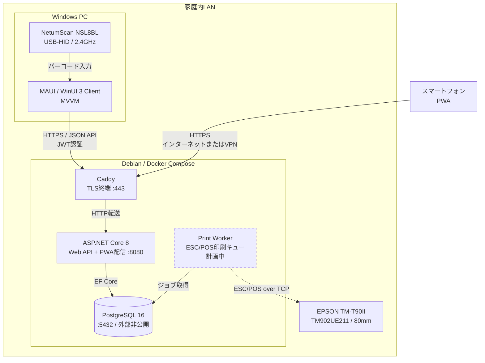

# アーキテクチャ

## 1. 方針

家庭内運用で保守しやすいモジュラーモノリスとします。WebとWindowsクライアントは同じHTTP APIだけを利用し、DBへ直接接続しません。スキャナとプリンタの機種依存処理はWindowsクライアント側のアダプタへ閉じ込めます。

## 2. コンポーネント

| コンポーネント | 推奨技術 | 責務 |
|---|---|---|
| Mobile Web | PWA / TypeScript | 日常操作、買い物、オフライン時の操作キュー |
| Web API | ASP.NET Core 8 | 認証、ユースケース、検証、監査 |
| Database | PostgreSQL | 商品、在庫履歴、買い物リストの永続化 |
| Windows Client | .NET 10 MAUI / WinUI 3 / MVVM | 高度な一覧、棚卸、デバイス連携 |
| Scanner Adapter | USB-HID | スキャン値をアプリ共通イベントへ変換 |
| Print Worker | Linux / ESC/POS over TCP | 80mm紙への整形、印刷キュー、再印刷 |
| Reverse Proxy | Caddy | TLS証明書、HTTPS終端、セキュリティヘッダー |

外出先から利用するため、Linux上でAPIとPostgreSQLをコンテナ運用します。DBポートは外部公開せず、CaddyだけがHTTPSを受けます。初期導入ではVPN（Tailscale等）経由を推奨し、一般公開が必要な場合だけインターネットへ443/TCPを公開します。どちらの場合もクライアントは同じHTTPS APIを利用します。

## 3. モジュール境界

```text
Identity       Household      Catalog
   │               │             │
   └───────────────┴──────┬──────┘
                          ▼
                      Inventory
                          │
                          ▼
                      Shopping
```

- Identity: 利用者、ログイン、権限
- Household: 世帯、メンバー、設定
- Catalog: 商品、カテゴリ、バーコード、単位
- Inventory: 保管場所、ロット、入出庫、棚卸
- Shopping: 補充提案、手動項目、購入状態、印刷用データ

## 4. データモデル

| エンティティ | 主な属性 |
|---|---|
| Household | Id, Name, TimeZone |
| User | Id, UserName, PasswordHash |
| HouseholdMember | HouseholdId, UserId, Role |
| Product | Id, HouseholdId, Name, Barcode, Unit, ReorderPoint, TargetQuantity |
| Category | Id, HouseholdId, Name, SortOrder |
| Location | Id, HouseholdId, Name, SortOrder |
| StockLot | Id, ProductId, LocationId, ExpiresOn |
| StockMovement | Id, LotId, Type, QuantityDelta, OccurredAt, ActorUserId, ReversesId |
| ShoppingList | Id, HouseholdId, Status, CreatedAt |
| ShoppingListItem | Id, ListId, ProductId?, Name, Quantity, Source, Status |

`StockLot`の数量は検索性能のため集計値を保持しても構いませんが、正は`StockMovement`です。更新時は同一トランザクション内で履歴追加と集計値更新を行い、楽観的同時実行制御を使います。

## 5. API概要

```text
POST   /api/auth/login
GET    /api/dashboard
GET    /api/products?query=&barcode=
POST   /api/products
PATCH  /api/products/{id}
GET    /api/inventory?locationId=&expiringBefore=
POST   /api/inventory/receive
POST   /api/inventory/consume
POST   /api/inventory/discard
POST   /api/inventory/adjust
GET    /api/movements?productId=
GET    /api/shopping-lists/current
POST   /api/shopping-lists/current/items
POST   /api/shopping-lists/current/generate
PATCH  /api/shopping-lists/current/items/{id}
POST   /api/shopping-lists/current/complete
GET    /api/shopping-lists/current/print
```

コマンドAPIは冪等性キーを受け取り、スマートフォンの再送や二重タップで数量が重複しないようにします。エラー形式はProblem Detailsへ統一します。

## 6. セキュリティと運用

- HTTPS必須。HTTPはHTTPSへリダイレクトし、CORSはPWAのオリジンだけを許可
- PostgreSQL、管理画面、デバッグ用APIはインターネットへ公開しない
- ログイン試行をレート制限し、アカウント列挙を防ぐ共通エラーを返す
- 初回利用者は設定用CLIではなく、一度だけ有効なセットアップ画面で作成
- JWT秘密鍵やDB接続情報はリポジトリへ置かず、Linuxサーバー上のsecretとして注入
- APIの認証は短命アクセストークンとローテーションする更新トークンを使用
- 更新トークンはHttpOnly・Secure・SameSite Cookie、WindowsクライアントではWindows資格情報ストアに保存
- PostgreSQLの日次バックアップを別媒体へ暗号化保存し、復元手順も定期的に確認する
- ヘルスチェック、構造化ログ、相関IDを用意する

## 7. デバイス境界

NetumScan NSL8BLはWindows端末へ2.4GHzレシーバーまたはUSBで接続し、HIDキーボードモードで使用します。読み取り終端をEnterに設定し、WinUI 3側は短時間に入力された文字列と終端キーを1スキャンとして扱います。Bluetoothは予備の接続手段とします。

EPSON TM-T90II TM902UE211は80mm紙・有線LAN（100BASE-TX/10BASE-T）モデルです。家庭内LANへ接続してDHCP予約でアドレスを固定し、Linux上のPrint Workerからネットワーク経由で印刷します。`IReceiptPrinter`境界の背後にESC/POS送信を実装し、開発用のPDF/テキスト出力と実機出力を差し替え可能にします。

印刷要求はDBの印刷ジョブへ保存してから処理します。プリンタの電源断、紙切れ、通信断は在庫処理へ影響させず、失敗ジョブを再実行できるようにします。プリンタは家庭内LANからだけ到達可能にし、インターネットへポートを公開しません。WindowsクライアントはAPIへ印刷を依頼し、プリンタへ直接接続しません。

## 8. 配備構成



実線は現在の主要な通信経路、破線は計画中の印刷経路を示します。PostgreSQLとAPIの`8080`番ポートはインターネットへ公開せず、外部からの通信はCaddyの`443`番ポートだけで受け付けます。PWAの静的ファイルはWeb APIから配信されるため、PWA専用コンテナはありません。
